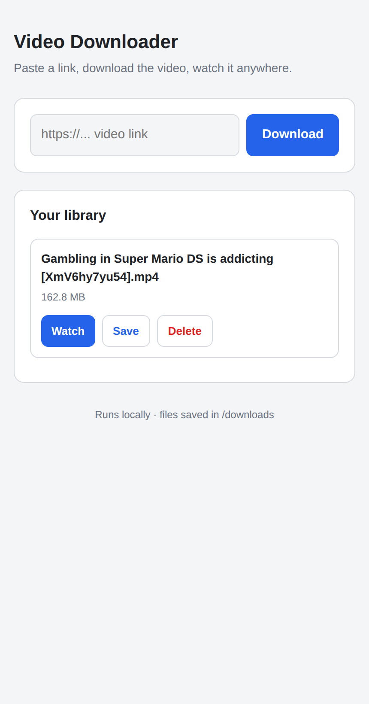

# Video Downloader

Ein kleines, lokales Web-Tool zum **Herunterladen und Ansehen von Videos**. Läuft auf
deinem PC und lässt sich vom Handy im selben WLAN bedienen. Schlichte, aufgeräumte
Oberfläche.



---

## Inhalt

- [Was das Tool kann](#was-das-tool-kann)
- [Voraussetzungen](#voraussetzungen)
- [Installation](#installation)
- [Starten](#starten)
- [Vom Handy aus benutzen](#vom-handy-aus-benutzen)
- [So benutzt du die Oberfläche](#so-benutzt-du-die-oberfläche)
- [Wo landen die Videos?](#wo-landen-die-videos)
- [Konfiguration](#konfiguration)
- [Projektstruktur](#projektstruktur)
- [Fehlerbehebung](#fehlerbehebung)
- [Hinweise](#hinweise)

---

## Was das Tool kann

- 📥 **Videos herunterladen** – Link einfügen, Knopf drücken. Nutzt [`yt-dlp`](https://github.com/yt-dlp/yt-dlp), unterstützt also YouTube und hunderte weitere Seiten.
- 📊 **Fortschrittsanzeige** in Echtzeit während des Downloads.
- ▶️ **Videos direkt im Browser ansehen** – auch am Handy.
- 💾 **Auf das Gerät speichern** oder wieder **löschen**.
- 📱 **Handy-tauglich** – bedienbar über den Browser im selben WLAN.

Die Videos werden als **MP4 (H.264/AAC)** gespeichert – das läuft auf praktisch jedem
Handy, Tablet und Fernseher.

---

## Voraussetzungen

- **Python 3.9+** (getestet mit 3.14)
- **ffmpeg** – wird gebraucht, um Video- und Tonspur zusammenzufügen
  - Ubuntu/Debian: `sudo apt install ffmpeg`
  - macOS: `brew install ffmpeg`
  - Windows: [ffmpeg.org/download](https://ffmpeg.org/download.html) oder `winget install ffmpeg`
- PC und Handy im **selben WLAN** (nur nötig, wenn du vom Handy aus zugreifst)

---

## Installation

```bash
# 1. Projekt holen
git clone https://github.com/BastianBinus/Download-YT.git
cd Download-YT

# 2. Virtuelle Umgebung anlegen und aktivieren
python3 -m venv .venv
source .venv/bin/activate        # Windows: .venv\Scripts\activate

# 3. Abhängigkeiten installieren
pip install -r requirements.txt
```

> `requirements.txt` enthält `flask` und `yt-dlp`.

---

## Starten

```bash
source .venv/bin/activate        # falls noch nicht aktiv
python3 app.py
```

Beim Start zeigt das Tool die Adressen an, unter denen es erreichbar ist:

```
==================================================
  Video Downloader is running
  On this PC:   http://127.0.0.1:5000
  On your phone (same WiFi): http://192.168.1.39:5000
==================================================
```

Öffne **http://127.0.0.1:5000** im Browser auf dem PC.

Zum Beenden: `Strg + C` im Terminal.

---

## Vom Handy aus benutzen

1. Stelle sicher, dass **PC und Handy im selben WLAN** sind.
2. Starte das Tool auf dem PC (siehe oben).
3. Öffne im **Handy-Browser** die „On your phone"-Adresse, z. B. `http://192.168.1.39:5000`
   (die genaue IP steht beim Start im Terminal).
4. Fertig – du kannst jetzt Videos laden, ansehen und aufs Handy speichern.

> **Tipp:** Wenn die Seite am Handy nicht lädt, blockiert meist die **Firewall** des PCs
> den Port 5000. Siehe [Fehlerbehebung](#fehlerbehebung).

---

## So benutzt du die Oberfläche

1. **Link einfügen** – kopiere die URL eines Videos (z. B. von YouTube) in das Eingabefeld
   `https://... video link`.
2. **„Download" drücken** – der Download startet, ein Fortschrittsbalken füllt sich.
3. Nach dem Download taucht das Video unten unter **„Your library"** auf. Dort gibt es
   pro Video drei Knöpfe:
   - **Watch** – Video direkt im Browser abspielen (öffnet einen Player).
   - **Save** – Datei auf dein Gerät (Handy/PC) herunterladen.
   - **Delete** – Video vom PC löschen (mit Rückfrage).

Alle bereits vorhandenen Videos im Download-Ordner werden beim Öffnen automatisch angezeigt.

---

## Wo landen die Videos?

Alle Downloads liegen im Ordner **`downloads/`** im Projektverzeichnis. Der Ordner wird
beim ersten Start automatisch erstellt.

Dateiname-Schema: `<Videotitel> [<Video-ID>].mp4`

> `downloads/` ist über `.gitignore` vom Repo ausgeschlossen – deine Videos werden also
> nicht versehentlich mit hochgeladen.

---

## Konfiguration

Die wichtigsten Stellschrauben stehen in **`app.py`**:

| Was | Wo | Standard |
|-----|-----|----------|
| **Port** | `app.run(..., port=5000)` | `5000` |
| **Download-Ordner** | `DOWNLOAD_DIR = BASE_DIR / "downloads"` | `downloads/` |
| **Videoqualität / Format** | `ydl_opts["format"]` | bestes MP4 (H.264 + AAC) |

Beispiel: Wenn Port 5000 belegt ist, ändere in `app.py` die letzte Zeile auf z. B.
`port=8000` und öffne dann `http://…:8000`.

Das Standard-Format ist bewusst auf maximale Kompatibilität gesetzt
(`bestvideo[vcodec^=avc1][ext=mp4]+bestaudio[ext=m4a]/best[ext=mp4]/best`). Wer immer die
absolut höchste Auflösung will (auch VP9/AV1, ggf. schlechter mit älteren Geräten
kompatibel), kann das Format-Feld anpassen – siehe die
[yt-dlp Format-Doku](https://github.com/yt-dlp/yt-dlp#format-selection).

---

## Projektstruktur

```
Download-YT/
├── app.py                 # Flask-Server + Download-Logik (yt-dlp)
├── templates/
│   ├── index.html         # Oberfläche
│   └── 404.html           # 404-Seite
├── requirements.txt       # Python-Abhängigkeiten (flask, yt-dlp)
├── downloads/             # heruntergeladene Videos (wird angelegt, nicht im Repo)
├── main.py                # ursprüngliches CLI-Skript (frag per Terminal nach URL)
└── README.md
```

### Kleiner CLI-Modus

`main.py` ist die einfache Ursprungsversion ohne Oberfläche – fragt im Terminal nach einer
URL und lädt das Video herunter:

```bash
python3 main.py
```

---

## Fehlerbehebung

**Die Seite lädt am Handy nicht (am PC aber schon).**
Die Firewall blockiert vermutlich Port 5000. Erlaube den Port:
- Ubuntu (ufw): `sudo ufw allow 5000/tcp`
- Windows: in der „Windows Defender Firewall" eine eingehende Regel für TCP-Port 5000 erlauben.
Prüfe außerdem, dass beide Geräte wirklich im **selben** WLAN sind (nicht Gäste-WLAN).

**`ffmpeg not found` oder Video ohne Ton / getrennte Dateien.**
`ffmpeg` ist nicht installiert oder nicht im PATH. Installieren (siehe
[Voraussetzungen](#voraussetzungen)) und Tool neu starten.

**„Address already in use" beim Start.**
Port 5000 ist noch belegt (evtl. läuft das Tool schon). Beende den alten Prozess
(`Strg + C`) oder ändere den Port in `app.py`.

**Download schlägt fehl / Video nicht verfügbar.**
Manche Seiten ändern häufig ihre Struktur. Aktualisiere `yt-dlp`:
```bash
pip install -U yt-dlp
```

**„That doesn't look like a URL".**
Der Link muss mit `http://` oder `https://` beginnen.

---

## Hinweise

- Das Tool startet einen **Entwicklungsserver** (Flask) und ist für den **lokalen Gebrauch
  im Heimnetz** gedacht – nicht dafür, offen ins Internet gestellt zu werden.
- Lade nur Inhalte herunter, zu denen du berechtigt bist. Beachte die Nutzungsbedingungen
  der jeweiligen Plattform und das Urheberrecht.
